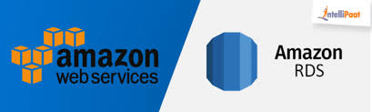
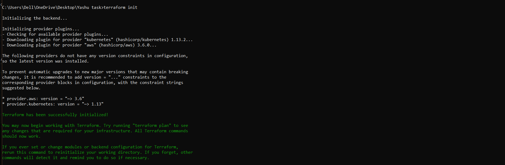
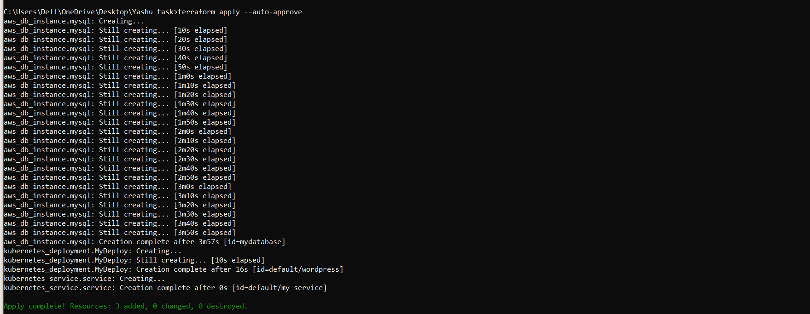
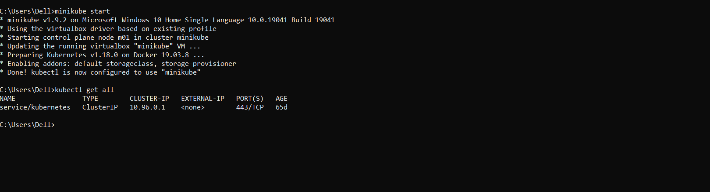
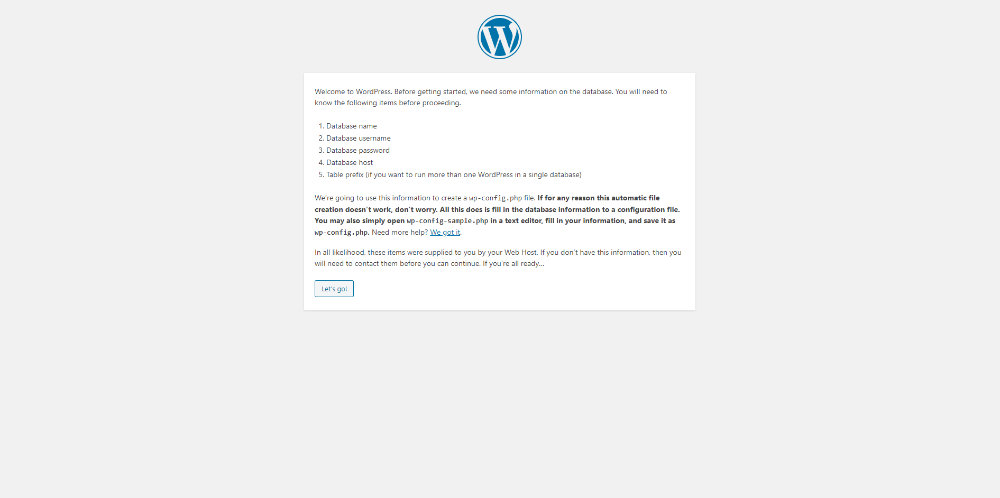

# Amazon RDS
Amazon Relational Database Service (Amazon RDS) makes it easy to set up,
operate, and scale a relational database in the cloud. It provides cost-
efficient  and resizable  capacity  while  automating  time-consuming
administration  tasks  such as  hardware  provisioning,  database setup,
patching and backups. It frees you to focus on your applications so you
can give them the fast  performance,  high availability,  security  and
compatibility they need.

# Kubernetes

Kubernetes is open  source software that allows you to deploy  and manage
containerized applications at  scale. Kubernetes  manages  clusters   of
Amazon EC2 compute  instances and runs containers on those instances with 
processes for  deployment, maintenance, and  scaling.  Using  Kubernetes,
you can run any type of containerized applications using the same toolset 
on-premises and in the cloud.

For running Kubernetes Service locally we need minikube..

# Minikube
Minikube is a tool that makes it easy to run Kubernetes locally. Minikube
runs a single-node  Kubernetes  cluster  inside a Virtual Machine (VM) on 
your laptop for users  looking to  try out  Kubernetes or develop with it
day-to-day.

# Terraform

Terraform is a tool for building, changing, and versioning infrastructure
safely and efficiently. Terraform can manage existing and popular service
providers as well as custom in-house solutions.

# Task 
Deploy the Wordpress application on Kubernetes and AWS using terraform including the following steps;

1. Write an Infrastructure as code using  terraform,  which automatically deploy the Wordpress application
2. On AWS, use RDS service for the relational database for Wordpress  application.
3. Deploy the Wordpress as a container either on top of Minikube or EKS or Fargate service on AWS
4. The Wordpress application should be accessible from the public world if deployed on AWS or through workstation if deployed on Minikube.

# Requirements:

1. We have to configure our Profile or IAM user
2. We need minikube or EKS for Kubernetes, Here I am using EKS Service.
3. For using EKS through command Line we have to install and configure eksctl.
4 We have to configure kubectl to launch wordpress.

# Steps

Confirguring the AWS profile in our CLI..

    provider "aws" {
    region     = "ap-south-1"
    profile    = "Yashu"
    }

Writing Terraform code for Launching AWS Relational DataBase Service...

    resource "aws_security_group" "sg-rds" {
    name        = "rds-database"
    vpc_id      = "vpc-12a7486f"

     ingress {
     description = "VPC"
     from_port   = 3306
     to_port     = 3306
     protocol    = "tcp"
     cidr_blocks = ["0.0.0.0/0"]
     }
     egress {
     from_port   = 0
     to_port     = 0
     protocol    = "-1"
     cidr_blocks = ["0.0.0.0/0"]
     }

    tags = {
      Name = "rds-database"
     }
   }

    resource "aws_db_instance" "wordpress-rds" {
     allocated_storage    = 10
     storage_type         = "gp2"
     engine               = "mysql"
     engine_version       = "5.7"
     identifier           = "database"
     instance_class       = "db.t2.micro"
     name                 = "mydb"
     username             = "wordpress"
     password             = "10987654321"
     parameter_group_name = "default.mysql5.7"
     publicly_accessible  = "true"
     port                 = "3303"
     final_snapshot_identifier = "false"
     skip_final_snapshot = "true"
    }

# Step

For launching Wordpress we will start minikube to start kubernetes using the command..

      minikube start
      
Now we will deploy Wordpress using the kubernetes, writing the code for wordpress deployment...

resource "kubernetes_service" "service" {
    depends_on = [kubernetes_deployment.MyDeploy]
  metadata {
    name = "my-service"
  }
    spec {
    selector = {
      App = kubernetes_deployment.MyDeploy.metadata.0.labels.App
    }
    
    port {
      node_port   = 30202
      port        = 8080
      target_port = 80
    }

    type = "NodePort"
    }  
}

    
    resource "kubernetes_deployment" "MyDeploy" {
      depends_on = [aws_db_instance.mysql]
      metadata {
      name = "wordpress"
      labels = {
        App = "MyApp"
      }
    }

    spec {
       replicas = 1

       selector {
         match_labels = {
           App = "MyApp"
         }
       }

       template {
         metadata {
          labels = {
             App = "MyApp"
            }
       }

      spec {
        container {
          image = "wordpress"
          name  = "my-wordpress"
         
         port {
               container_port = 80
            }
          
        }
      
    }
  }
}

}
      
After writing the Whole code using the teraform command we will launch our infrastructure..
for this we have to download terraform plugins using commands..

     terraform init
     
     
     
     
     
    
Now we will run the command.

     terraform apply --auto-approve
     
 
 
 
 
 
 With the kubectl commands we can see our deployed wordpress pods..
 
     kubectl get all
     
     
  
  
  
  
     
Now using the Minikube IP we acess our wordpress site..     

     
 
    
    
 For connecting our wordpress to our database we can enter the RDS database details...
 
 
     
     
 For destroying whole infrastructure we can run terraform command
 
      Terraform destroy --auto-approve
      
      
   
   Its DONE
      
  THANK YOU EVERYONE!!    
